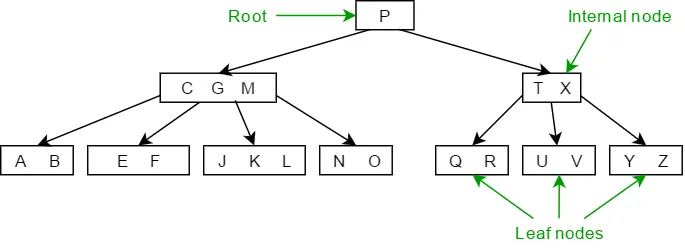

# B+ Tree: 
B+ Tree is a **self-balancing tree** data structure, Unlike a binary tree, nodes in a B+ tree can have **more than two children**. Its structure ensures that the tree remains **balanced**, keeping the height relatively low.

## Characteristics
- **Internal nodes (non-leaf)** only store keys to guide the search process.

- **Leaf nodes** store the actual data (key-value pairs) and are linked (like linked lists).



> [!TIP]
> All leaves are connected through a linked list for fast traversal.

## B+ Tree Structure

Every leaf node in the B+ Tree is at the same distance from the root node. The B+ Tree has an **order of n**, with n being the same for all B plus trees.


## Examples 

Problem: Insert the following key values 6, 16, 26, 36, 46 on a B+ tree with order = 3. 


The order is 3 only 2 key can be adedd without splitting and 3 pointer

```
---------------------
|P| Key  |P| Key  |P|
---------------------
```
### Insertion

- Step 1: insert 6,16

first tow key can be insertd dirctly:

```cs

                        [6,16]

```

- step 2: insert 26

```cs

    1                  [6,16,26]   // The node is full only 2 keys in one nde
                                   // Promot middle value (16)
    --------------------------------------
    2                   [16]
                       /    \
                    [6]     [16,26]

```

- step 3: insert 36

```cs

    1                  [6,16,26]  
 --------------------------------------
    2                   [16]
                       /    \
                    [6]     [16,26,36]  // node full, promot middle value (26), shift small value (16) left
 --------------------------------------
    3                    [16,26]
                       /    |    \
                    [6] -> [16] -> [26,36] 
```

- step 3: insert 46

```cs
    1                    [16,26]
                       /    |    \
                    [6]   [16]   [26,36,46] // node full, promot middle value (36)
 --------------------------------------
    2                   [16,26,36]  // node full, promot middle value
                       /    |    \
                    [6]   [16]   [26,36,46] // shift 26 left
 --------------------------------------
                             [26]
                           /       \
                       [16]         [36]   
                      /    \       /    \
                    [6] -> [16]-> [26]-> [36,46]  
```

### Deletion

- Delete 5:

```cs
    1                         [26]
                           /       \
                       [16]         [36]   
                      /    \       /    \
                           [16]     [26]-> [36,46]  // delete 5 then fix left node, must have same size
 --------------------------------------
    2                        [26]
                           /      \
                       [16]        [36]            // Promot 36
                                  /    \
                               [26]-> [36,46]      // shift 26 left
 --------------------------------------
    3                       [26,36]
                           /   |    \
                       [16]   [26]   [36,46]     
                                    
```

<details>

 <summary>Intermediate example</summary>

We will build a B+ Tree with an order of 3, using this values:

```
10, 20, 5, 6, 12, 30, 7, 17
```

> [!IMPORTANT]  
> The order defines the maximum number of children an internal node can have. <br/>
> Add key then promot the middle value <br/>


### Insertion :

- Step 1: Insert 10

Initially, the tree is empty. After inserting 10, the root contains just one key.

```cs
---------------------
|P| 10  |P|       |P|
---------------------
```

- Step 2: Insert 20

Since there’s room, 20 is added to the root node.

```cs
---------------------
|P|  10  |P|  20  |P|
---------------------
```

- Step 3: Insert 5 (Root Splits)

```cs
  ---------------------
5 |P|  10  |P|  20  |P|    // 5 is overflow
  ---------------------
```

Now, the root is full (2 keys), so it needs to be split. The **middle key** (10) is promoted to a new root, and two new leaf nodes are created:

*# We Will insert each parent of node in frist key*

```cs
        [10]
       /    \
    [5]----->[10,20]  // Add 10 again
```

- Step 4: Insert 6 

6 < 10 so will be inserted intto the left leaf

```cs
         [10]
        /    \
    [5,6]---->[10,20] 
```

- Step 5: Insert 12

12 is inserted into the right leaf node because it’s greater than 10. But  The right child [15, 20] is full, so we split again.

```cs
    Less----[10,12]---- Bigger
      |     Bet|ween     |
    [5,6]---->[10]----->[12,20]  // becuse root node has tow value so it will has less, between and bigger
```

- Step 6: Insert 30 

30 is greater than so will be inserted intto the right leaf

```cs
 1        [10,12] 
         /   |    \
    [5,6]-->[10]-->[12,20,*30*]  // maximum keys, promot the middle 20
-----------------------------------
 2       [10,12,*20*]           // maximum keys, promot the middle 12
         /   |    \
    [5,6]-->[10]-->[12,20,30]  // 12 is not bigger than 20, shift to left
-----------------------------------
 3            [12]
          ___/    \___
        [10]         [20]         
       /    \       /     \
    [5,6]-->[10]-->[12]-->[20,30]
```

- Step 7: Insert 7 

```cs
  1            [12]
           ___/    \___
         [10]         [20]         
       /    \       /     \
    [5,6]-->[10]-->[12]-->[20,30]
-----------------------------------
  2            [12]
           ___/    \___
         [10]         [20]         
        /    \       /     \
    [5,6,*7*]-->[10]-->[12]-->[20,30]   // maximum keys, promot the middle 6
-----------------------------------
  3               [12]
             ____/    \_____
         [6,10]           [20]         
        /   |   \        /     \
    [5,]->[6,7]->[10]->[12]->[20,30]  // 7 is between 6 and 10 
```

- Step 8: Insert 7 

    - 17 greater than 12 so the right leaf node.
    - 17 is less than 20 so the left node.
    - There is space for 17, insert it.

```cs

                  [12]
             ____/    \_____
          [6,10]           [20]         
        /   |   \        /     \
    [5]->[6,7]->[10]->[12,*17*]->[20,30]   

```

### Deletion : 

- Delete 5:

```cs

                  [12]
             ____/    \_____
          [6,10]           [20]         
        /   |   \        /     \
          [6,7]->[10]->[12,17]->[20,30]   // Delete 5
    ---------------------------------------

                 [12]
             ____/    \_____
          [7,10]           [20]             // 7         
        /   |   \        /     \
       [6]->[7]->[10]->[12,17]->[20,30]   // 6 is smaller value 

```

- Delete 20:

```cs

                  [12]
             ____/    \_____
          [6,10]                    
        /   |   \           /     \
      [6]->[7]->[10]->[12,17]->[  ,30]   // Delete 5
    ---------------------------------------

                 [12]
             ____/    \_____
          [7,10]             [30]                 
        /   |   \           /     \
       [6]->[7]->[10]->[12,17]->[30]   // 6 is smaller value 

```
</details>
