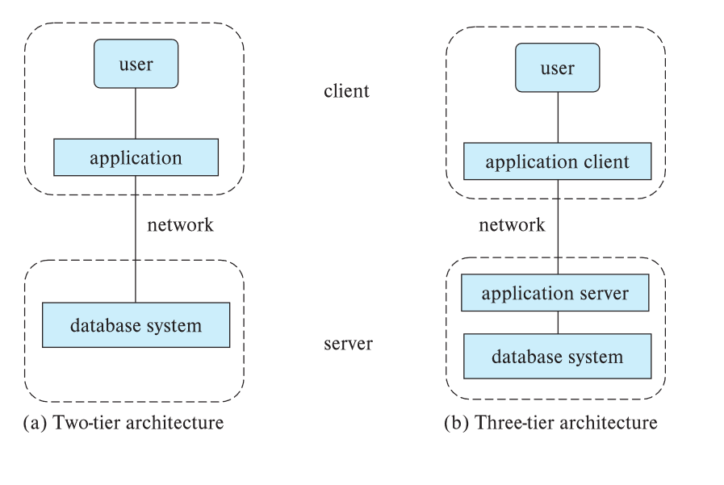

 

## Declarative vs. Procedural DML

There are basically two types of data-manipulation language:

| Aspect                         | Declarative DML (e.g., SQL)                                   | Procedural DML                                                              |
|---------------------------------|----------------------------------------------------------------|----------------------------------------------------------------------------|
| Approach                        | Focuses on "what" data is needed without specifying how to get it. | Specifies both "what" data is needed and "how" to retrieve it.              |
| Ease of Use                     | Easier to learn and use, especially for beginners.             | Requires more understanding of the underlying data structure and process.   |
| Control                         | Less control over the execution plan, managed by the DBMS.     | Full control over data retrieval and execution process.                     |

 

## Centralized vs. Distributed Databases

| Aspect                          | Centralized Database                                          | Distributed Database                                                        |
|----------------------------------|---------------------------------------------------------------|-----------------------------------------------------------------------------|
| Architecture                     | Single database instance running on one server or machine.    | Data is distributed across multiple servers or geographic locations.        |
| Scalability                      | Limited scalability | Highly scalable             |
| Performance                      | May face performance bottlenecks | Designed for high availability  |
| Use Case                         | Suitable for smaller systems or organizations with limited data. | Ideal for large organizations, global systems, or high-availability systems. |

 

## Two-Tier vs. Three-Tier Architecture

| Aspect                          | Two-Tier Architecture                                        | Three-Tier Architecture                                                     |
|----------------------------------|--------------------------------------------------------------|-----------------------------------------------------------------------------|
| Structure                        | Client communicates directly with the database server.       | Client interacts with an application server, which then communicates with the database. |
| Complexity                       | Simpler architecture, easier to set up.                      | More complex, requires separate layers for application logic and data management. |
| Use Case                         | Suitable for smaller applications or environments.           | Better suited for large, enterprise-level applications with complex logic.  |
| Security                         | Less secure, as clients have more direct access to the database. | More secure, as the application layer can provide additional security controls. |

 

## Transaction Management vs. Query Processing
This comparison explores the distinct roles of transaction management and query processing in database systems.

| Aspect                          | Transaction Management                                      | Query Processing                                                            |
|----------------------------------|--------------------------------------------------------------|-----------------------------------------------------------------------------|
| Focus                            | Ensures consistency, atomicity, and concurrency of transactions. | Focuses on optimizing and executing queries efficiently.                    |
| Key Components                   | Transaction manager, concurrency control manager.            | DDL  interpreter, DML compiler , query evaluation engine.                      |
| Responsibilities                 | Handles multiple transactions, ensuring no conflicts or data inconsistency. | Translates and optimizes queries for efficient data retrieval.              |
| Example                          | Ensuring funds are transferred correctly between two accounts. | Fetching all customer details from the database efficiently.   |
 
 ## DDL vs. DML

 | Aspect                            | DDL (Data Definition Language)                              | DML (Data Manipulation Language)                                              |
|------------------------------------|-------------------------------------------------------------|-------------------------------------------------------------------------------|
| Purpose                            | Used to define and modify the database schema.               | Used to access and manipulate the data stored within the database.            |
| Key Operations                     | CREATE, ALTER, DROP (e.g., `CREATE TABLE instructor (...)`). | SELECT, INSERT, UPDATE, DELETE (e.g., `SELECT * FROM instructor`).            |
| Schema Impact                      | Changes the structure of the database (creates or modifies tables, indexes, etc.). | Does not alter the database structure; only modifies the data.                |
| Execution                          | Executes commands that impact the metadata or structure of the database. | Executes commands that impact the actual data stored in the database.         |
| Example                            | `CREATE TABLE instructor (ID char(5), name varchar(20));`    | `SELECT name FROM instructor WHERE dept_name = 'Comp. Sci.';`                 |
